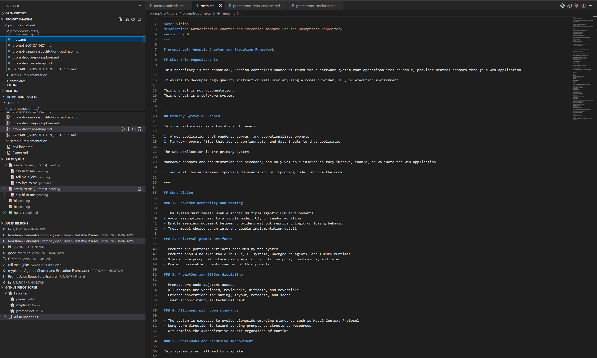

# Promptroot VS Code Extension

<p align="center">
  <a href="https://promptroot.ai">
    
  </a>
</p>

> **[promptroot.ai](https://promptroot.ai)** — Cultivate your team's AI knowledge.

Manage prompts, queue tasks, and track Jules sessions directly inside VS Code. Same account, same data, real-time sync with the [PromptRoot web app](https://promptroot.ai).



## Features

### Prompt Asset Browser
- Browse all prompts in the Explorer sidebar tree view
- Create prompts with guided workflows and 3 template types
- Clone, delete, and organize prompt assets
- Real-time sync with `prompts/` directory

### Jules Queue Management
- Add single or batch prompts to the processing queue
- Run, pause, resume, and delete queue items
- Visual queue with status icons and real-time updates
- Subtask management via WebView

### Session & PR Tracking
- View Jules session history with PR links and status
- Session details WebView with logs and PR info
- Filter by status, name, repo, or date range
- Open GitHub PRs directly from session results

### GitHub OAuth Authentication
- Sign in with the same GitHub account you use on [promptroot.ai](https://promptroot.ai)
- Secure token storage via VS Code SecretStorage
- Status bar integration for user info and connection status

### Repository & Branch Management
- Browse configured repositories with favorites
- Smart branch picker with recent branches and search
- Set per-repo default branches for quick selection

### Error Handling & Recovery
- 9 error categories with specific recovery suggestions
- Exponential backoff for transient errors
- Connection monitoring with real-time status indicators

## Quick Start

1. **Install** — Search "Promptroot" in the Extensions panel or run:
   ```
   code --install-extension promptroot.promptroot-vscode
   ```

2. **Open a workspace** — Look for "PROMPTROOT ASSETS" in Explorer

3. **Sign in** — `Ctrl+Shift+P` → `Promptroot: Sign In` (same GitHub account as [promptroot.ai](https://promptroot.ai))

4. **Create a prompt** — `Ctrl+Shift+P` → `Promptroot: Create New Prompt Asset`

5. **Queue & run** — Right-click a prompt → "Add to Jules Queue" → "Run All Pending"

## Commands

| Category | Command | Description |
|----------|---------|-------------|
| **Auth** | `Promptroot: Sign In` | GitHub OAuth authentication |
| | `Promptroot: Sign Out` | Sign out and clear tokens |
| | `Promptroot: View Profile` | Display profile info |
| **Assets** | `Promptroot: Create New Prompt Asset` | Guided creation workflow |
| | `Promptroot: Browse Assets` | Focus tree view |
| | `Promptroot: Initialize Workspace` | Create prompts directory |
| **Queue** | `Promptroot: Add to Queue` | Single prompt |
| | `Promptroot: Add Batch to Queue` | Multiple prompts |
| | `Promptroot: Run All Pending` | Process entire queue |
| | `Promptroot: Run Queue Item` | Execute specific item |
| **Sessions** | `Promptroot: View Session Details` | Open session WebView |
| | `Promptroot: Filter Sessions` | Filter by status |
| | `Promptroot: Open PR in Browser` | Open GitHub PR |
| **Repos** | `Promptroot: Select Branch` | Branch picker |
| | `Promptroot: Add Favorite Repository` | Star repos |
| **Tools** | `Promptroot: Configure Jules API` | Set up API key |
| | `Promptroot: Show Connection Status` | Service status |
| | `Promptroot: Report Error` | Diagnostic report |

## Tree Views

The extension adds four tree views to the Explorer sidebar:

| View | Description |
|------|-------------|
| **PROMPTROOT ASSETS** | Browse local `.md` files in `prompts/` |
| **PROMPTROOT QUEUE** | Manage processing queue with status indicators |
| **PROMPTROOT SESSIONS** | Track Jules session history with PR links |
| **PROMPTROOT REPOSITORIES** | Browse repos with favorites and branch info |

## Configuration

| Setting | Type | Default | Description |
|---------|------|---------|-------------|
| `promptroot.assetsPath` | string | `"prompts"` | Path to prompts directory |
| `promptroot.autoDetect` | boolean | `true` | Auto-detect Promptroot workspaces |
| `promptroot.firebase.useEmulator` | boolean | `false` | Use Firebase emulators |
| `promptroot.firebase.emulatorHost` | string | `"localhost"` | Emulator host |

## Data Synchronization

The extension uses the same Firebase backend as [promptroot.ai](https://promptroot.ai):

- **Same Account** — sign in with GitHub, see the same data everywhere
- **Real-time Sync** — changes appear in the web app immediately
- **Offline Support** — local prompt browsing works without connection
- **Secure Storage** — all data encrypted and user-isolated

## Requirements

- **VS Code** 1.85.0 or higher (also works with Cursor and other VS Code forks)
- **GitHub Account** — same account as [promptroot.ai](https://promptroot.ai)
- **Internet Connection** — required for auth and sync

## Troubleshooting

| Problem | Solution |
|---------|----------|
| Extension not loading | Check Output panel → "Promptroot". Try `Developer: Reload Window`. |
| Auth issues | Sign out and back in. Check internet & firewall. |
| Queue/sessions empty | Verify sign-in (status bar). Run `Show Connection Status`. |
| Slow with large workspace | Use `Refresh Assets` sparingly. Exclude large directories. |

## Contributing

See [CONTRIBUTING.md](./CONTRIBUTING.md) for development setup, testing, and architecture details.

## License

AGPL-3.0-only — see [LICENSE](./LICENSE).

---

**[promptroot.ai](https://promptroot.ai)** | [GitHub](https://github.com/promptroot/promptroot) | [Issues](https://github.com/promptroot/promptroot/issues)
